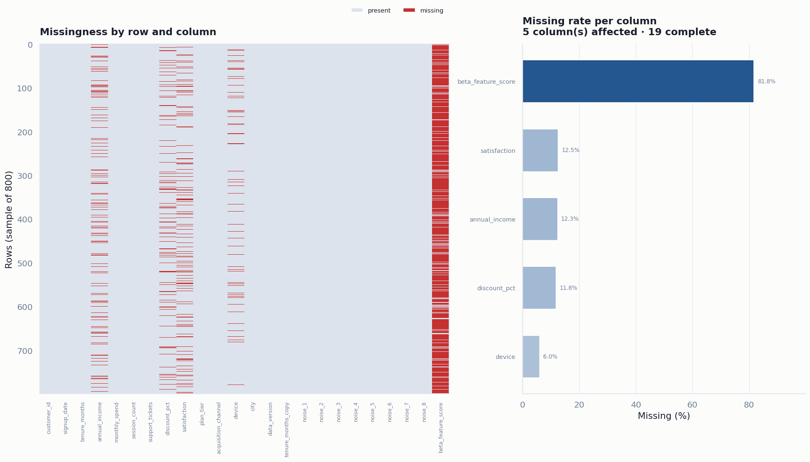
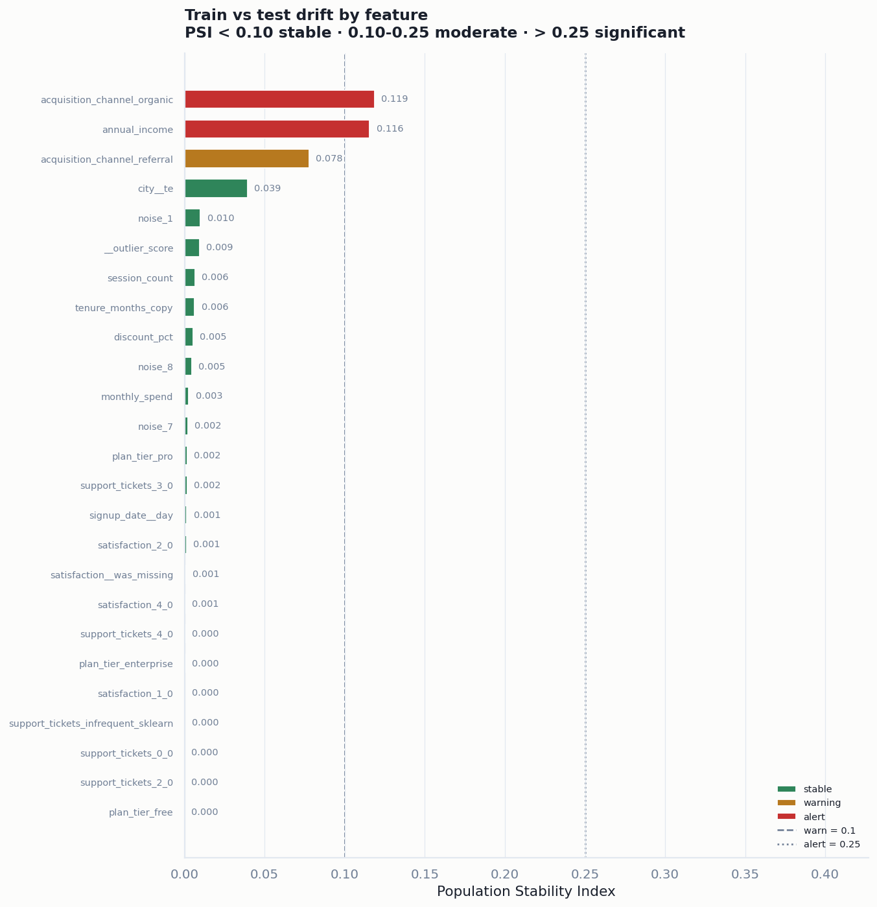
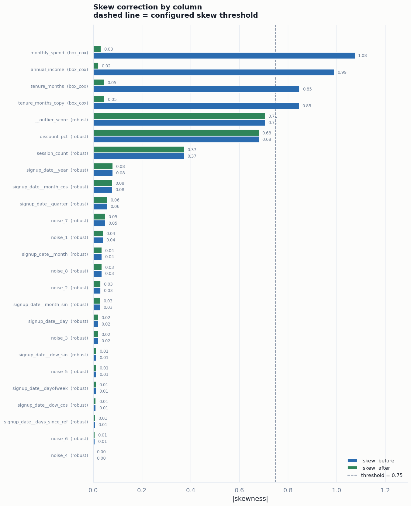
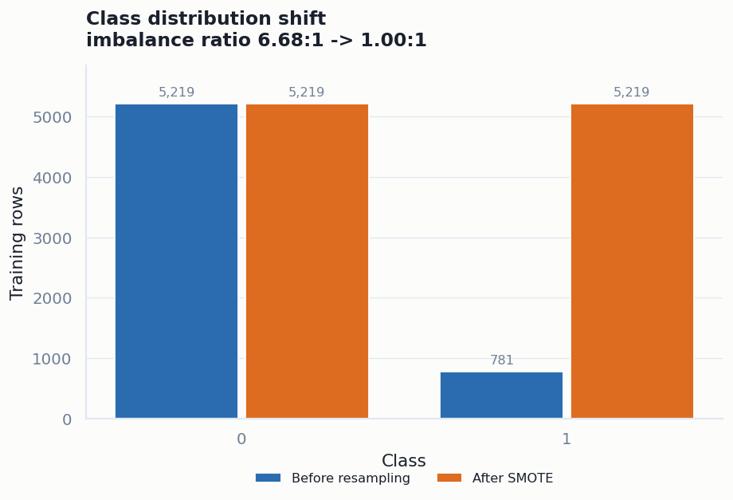
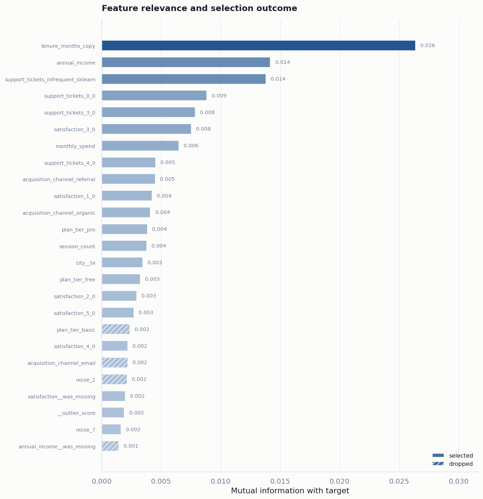
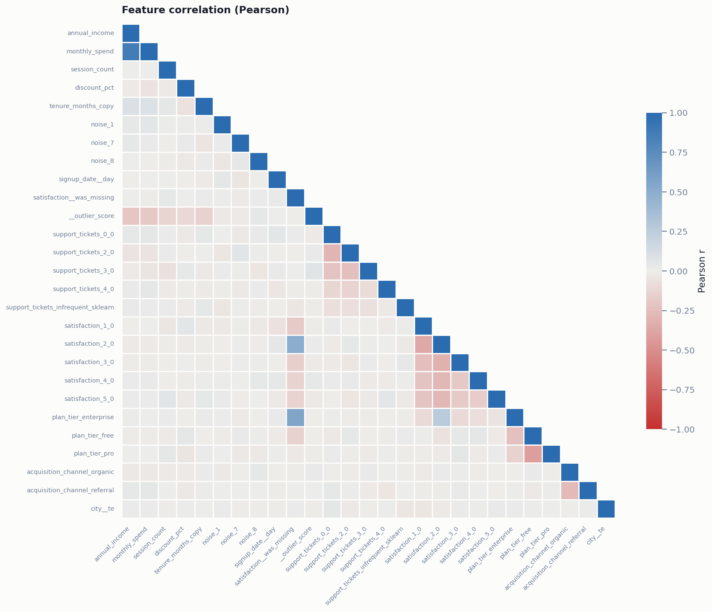

# DataPulse Engine

[](https://github.com/YOUR-USERNAME/datapulse-engine/actions/workflows/ci.yml)
[](https://www.python.org/downloads/)
[](https://scikit-learn.org/)
[](LICENSE)
[](tests/test_datapulse.py)

**An enterprise-grade, modular data preprocessing, feature engineering and pipeline framework for tabular machine learning.**

DataPulse turns a raw, messy, imbalanced table into a model-ready feature matrix — and packages the entire transformation chain into a single deployable artifact. Every stage is a Scikit-Learn transformer, every parameter is Pydantic-validated, and every DataFrame keeps its column names from end to end.

The framework is built around one conviction: **preprocessing is part of the model.** Imputation fills, winsorization fences, encoder vocabularies and scaler centres are learned parameters. If they do not ship with the model, the model is not deployable — and if they are learned on the wrong rows, the model is not trustworthy.

---

## Why this exists

Most preprocessing code fails in one of four ways. DataPulse addresses each structurally rather than by convention:

| Failure mode | What usually happens | What DataPulse does |
|---|---|---|
| **Target leakage** | Target encoding computed on all training rows, then applied to those same rows | Out-of-fold encoding: fold *i* is encoded using folds `≠ i` only. `fit_transform` and `transform` deliberately return different values on training data. |
| **Resampling leakage** | SMOTE run before the split, or on the test set | `SmartResampler.transform` is an identity map. Sampling exists **only** inside `fit_resample`. `resample()` raises `LeakageGuardError` unconditionally. |
| **Silent column drift** | Positional arrays mis-align when a serving payload changes shape | Every transformer records `feature_names_in_` and raises `SchemaError` on a missing column. |
| **Undeployable artifacts** | The notebook's `StandardScaler` never leaves the notebook | One `.joblib` file holds the whole chain plus a JSON metadata sidecar (library versions, dtypes, class prior, data fingerprint). |

---

## Architecture

```
datapulse_engine/
├── main.py                          # End-to-end executable demo
├── pyproject.toml                   # Packaging, lint and test configuration
├── requirements.txt
├── datapulse/
│   ├── __init__.py                  # Public API
│   ├── base.py                      # AbstractTransformer (the framework contract)
│   ├── config.py                    # Pydantic PipelineConfig + 10 section configs
│   ├── exceptions.py                # DataPulseError hierarchy
│   ├── logger.py                    # Centralised logging
│   ├── core/
│   │   ├── schema_inference.py      # Module 1  - schema & type inference
│   │   ├── imputation.py            # Module 2  - context-aware imputation
│   │   ├── outliers.py              # Module 3  - IQR + Isolation Forest engine
│   │   ├── scaling.py               # Module 4  - skew detection & adaptive scaling
│   │   ├── encoding.py              # Module 5  - OOF target + one-hot encoding
│   │   ├── resampling.py            # Module 6  - SMOTE / Borderline / ADASYN
│   │   ├── feature_selection.py     # Module 7  - variance → MI → L1-RFE
│   │   └── drift.py                 # Module 8  - PSI, Wasserstein, KS audit
│   ├── reporting/
│   │   ├── palette.py               # Validated, colourblind-safe colour system
│   │   └── visuals.py               # Module 9  - automated plot suite
│   ├── pipeline/
│   │   ├── builder.py               # DataPulseEngine orchestrator
│   │   └── serialization.py         # Module 10 - artifact packaging
│   ├── data/synthetic.py            # Deliberately awful demo dataset
│   └── utils/validation.py          # Shared helpers
├── tests/test_datapulse.py          # 60 tests, incl. a leakage-guard suite
├── reports/                         # Generated figures
└── artifacts/                       # Generated .joblib + .meta.json
```

### The framework contract

Every module subclasses `AbstractTransformer(BaseEstimator, TransformerMixin)`, which provides:

- **DataFrame in, DataFrame out** — column names, dtypes and index survive the whole chain.
- **Schema enforcement** — a missing column at inference time is an error, not a silent mis-alignment.
- **Uniform diagnostics** — `fit_report_` captures timings, row/column deltas and stage-specific notes.
- **Error wrapping** — any failure surfaces as a `TransformerError` naming the stage.

Subclasses implement only `_fit` and `_transform`.

---

## Quick start

```bash
pip install -r requirements.txt
python main.py                    # full demo on 8,000 synthetic rows
python main.py --rows 50000 --sampler adasyn
python main.py --no-reports       # skip figure rendering
pytest -q                         # 60 tests
pytest --doctest-modules datapulse -q
```

### Library usage

```python
from datapulse import DataPulseEngine, PipelineConfig
from datapulse.config import NumericalImputationStrategy, OutlierAction, ResamplingStrategy

config = PipelineConfig(target_column="churned", task_type="classification", random_state=42)
config.imputation.numerical_strategy = NumericalImputationStrategy.KNN
config.outliers.action = OutlierAction.CLIP
config.resampling.strategy = ResamplingStrategy.BORDERLINE_SMOTE
config.feature_selection.protected_features = ["tenure_months"]   # never dropped

engine = DataPulseEngine(config)

X_train, y_train = engine.fit_transform(train_df)   # fitted + resampled
X_test,  y_test  = engine.transform(test_df, with_target=True)   # never resampled

engine.audit_drift(train_df, test_df)
engine.generate_reports()
artifact = engine.save()            # artifacts/datapulse_pipeline.joblib
```

### Serving

```python
from datapulse import DataPulseEngine

artifact = DataPulseEngine.load("artifacts/datapulse_pipeline.joblib")
print(artifact.check_environment())        # [] when library versions match
features = artifact.transform(incoming_df) # ready for model.predict()
```

The artifact contains stages 1–8 only. The resampler is training-only and is deliberately excluded.

---

## The ten modules

### 1. Auto schema & type inference — `core/schema_inference.py`

Classifies every column as `numerical`, `categorical_low`, `categorical_high`, `datetime`, `boolean` or `dropped`, using cardinality, parseability and null-rate heuristics — then **coerces** the frame so downstream stages can trust their inputs.

Handles: currency strings (`"$1,204.50"` → `1204.50`), date strings, integer ratings that are really categories, near-unique integer identifiers (dropped — they are keys, not features), and constant columns.

`DateTimeFeaturizer` then explodes each timestamp into year / month / day / day-of-week / quarter / hour / weekend / days-since-reference, plus **cyclical** sine–cosine encodings — because raw `month` tells a linear model that December is maximally far from January, which is backwards. The emitted column list is fixed at fit time so a single-day scoring batch cannot change the matrix width.

### 2. Context-aware imputer — `core/imputation.py`

- **Numerical:** mean / median / **KNN** / **iterative (MICE-style)** / constant.
- **Categorical:** mode / **frequency** (distribution-preserving random draw) / sentinel.
- Columns emptier than `drop_columns_above_na_rate` are dropped — imputing a 90 %-null column manufactures signal.
- `<col>__was_missing` indicators are emitted **before** filling, because missingness is frequently predictive (enterprise accounts skipping the satisfaction survey, in the demo data).

### 3. Outlier engine — `core/outliers.py`

Two views of "outlier", combined in `hybrid` mode:

- **Univariate** — IQR fences intersected with quantile winsorization bounds.
- **Multivariate** — Isolation Forest, which catches rows that are anomalous *as a combination* even though no single field is.

Four decoupled actions:

| Action | Behaviour | Inference-safe? |
|---|---|---|
| `clip` | Winsorise to the fitted fence | ✅ |
| `mask` | Replace with `NaN` for a downstream imputer | ✅ |
| `flag` | Append `__outlier_score` / `__is_outlier` features | ✅ |
| `drop` | Remove the row | ❌ **training only** |

`drop` is exposed through `fit_resample(X, y)` — mirroring the imbalanced-learn sampler API so `X` and `y` stay aligned — and is capped by `max_drop_fraction`. Calling `transform` with `action="drop"` degrades to clipping, because a scoring service must return a prediction for every record it receives.

### 4. Smart scaling & skew transformer — `core/scaling.py`

Per column: run a normality test (**D'Agostino–Pearson** for n ≥ 20, **Shapiro–Wilk** below; `AUTO` picks), measure skewness, then route:

| Condition | Treatment |
|---|---|
| Passes normality, \|skew\| ≤ threshold | `StandardScaler` |
| \|skew\| > threshold, strictly positive | **Box-Cox** + standardise |
| \|skew\| > threshold, has zeros/negatives | **Yeo-Johnson** + standardise |
| Otherwise (heavy tails, non-normal) | `RobustScaler` (median / IQR) |

Every decision — test used, p-value, skew before and after — lands in `scaler.skew_report()` and in the rendered figure. On the demo data, `monthly_spend` goes from skew 1.07 → −0.03 via Box-Cox.

### 5. Categorical encoder pipeline — `core/encoding.py`

- **Low cardinality** → `OneHotEncoder` with `min_frequency` collapsing and `handle_unknown` safety.
- **High cardinality** → **out-of-fold target encoding**, m-estimate smoothed toward the global prior:

  ```
  encoding = (n_c · mean_c + m · prior) / (n_c + m)
  ```

  plus optional `<col>__freq` count encoding.

**Why out-of-fold.** Naive target encoding computes `mean(y | category)` on the full training set and applies it to that same training set. Every row contributes to its own encoded value; for a rare category the encoding *is* the label. `fit_transform` therefore returns K-fold out-of-fold values, while `transform` applies the full-data mapping — legitimate for holdout rows, which never contributed to it.

The demo measures this directly:

```
naive (in-fold) r = +0.1334   <- inflated, leaks
out-of-fold     r = -0.0292   <- honest, what the model sees
leakage suppressed by 78.1%
```

> ⚠️ Corollary: `engine.transform(train_df)` applies the *full-data* encoding and must not be used to build a training matrix. Use `engine.fit_transform(train_df)`.

### 6. Class imbalance & resampling — `core/resampling.py`

SMOTE, Borderline-SMOTE, ADASYN and SMOTE-NC, with safeguards that are structural rather than advisory:

- Sampling exists **only** in `fit_resample`; `transform` is an identity map, so a resampler placed in a standard `Pipeline` leaves holdout data untouched.
- `resample()` raises `LeakageGuardError` unconditionally.
- Vetoes with a stated reason when: the task is regression, the minority class is smaller than `min_minority_samples`, the imbalance ratio is below `imbalance_ratio_trigger`, or `NaN` remain.
- `k_neighbors` is auto-clamped below the minority class size.

### 7. Feature selection suite — `core/feature_selection.py`

Four stages of increasing cost and increasing target-awareness:

1. **Variance threshold** — removes constants and near-constants.
2. **Correlation pruning** — greedily drops one of each pair above `drop_correlated_above`, keeping the higher-variance member.
3. **Mutual information** — non-parametric, catches non-linear dependence Pearson misses. Top-k / percentile / threshold modes.
4. **L1-based RFE** — Recursive Feature Elimination around an L1-penalised linear model, optionally cross-validated. Features are judged *jointly*, not marginally.

`protected_features` bypass every stage. `min_features_to_keep` is a hard floor. The per-feature audit (`selector.ranking()`) records which stage dropped what.

### 8. Data drift & quality checks — `core/drift.py`

Per column, against a reference distribution:

- **PSI** — `Σ (aᵢ − eᵢ)·ln(aᵢ/eᵢ)` over reference-quantile bins. Conventional bands: `< 0.10` stable, `0.10–0.25` moderate, `> 0.25` significant. Discrete columns (binary flags, one-hot dummies, rating scales) are binned per distinct value, so they cannot collapse to a meaningless `0`.
- **Wasserstein distance** — binning-free earth-mover's distance on the **z-scored** scale, so thresholds are comparable across units. Categorical columns use total-variation distance instead, since they have no natural ordering.
- **Kolmogorov–Smirnov** — advisory p-value. On large samples KS flags differences far too small to matter, which is why PSI and Wasserstein carry the verdict.

Output is a traffic-light `DriftReport` with `.alerts`, `.warnings`, `.is_stable` and `.to_frame()`.

### 9. Visual reporting suite — `reporting/visuals.py`

Six figures, each answering one question:

| Figure | Question |
|---|---|
| `correlation_heatmap` | Which features are redundant? |
| `nullity_matrix` | Is missingness random, or structured by row? |
| `class_balance_smote` | What exactly did SMOTE do to the label prior? |
| `skew_transformations` | Did the power transforms actually work? |
| `drift_psi` | Which columns moved between train and test? |
| `feature_relevance` | Which features survived selection, and why? |

The colour system in `reporting/palette.py` is validated rather than chosen by taste: a fixed categorical order (never cycled), a single-hue sequential ramp for magnitude, a two-hue diverging ramp with a **neutral grey** midpoint for correlation, and reserved status colours for drift severity. Identity is never carried by colour alone — every chart ships a legend and direct value labels.

<table>
<tr>
<td width="50%"><br><sub><b>Nullity matrix</b> — structured missingness is visible as stripes; enterprise accounts skip the satisfaction survey.</sub></td>
<td width="50%"><br><sub><b>Drift audit</b> — the two shifts injected into the holdout are flagged; the stable columns are not.</sub></td>
</tr>
<tr>
<td width="50%"><br><sub><b>Skew correction</b> — <code>monthly_spend</code> goes 1.08 → 0.03 via Box-Cox.</sub></td>
<td width="50%"><br><sub><b>Class balance</b> — 6.68:1 → 1.00:1, training split only.</sub></td>
</tr>
<tr>
<td width="50%"><br><sub><b>Feature relevance</b> — mutual information with the selection verdict.</sub></td>
<td width="50%"><br><sub><b>Correlation</b> — diverging ramp with a neutral midpoint, so the sign is readable.</sub></td>
</tr>
</table>

### 10. Pipeline serialization & export — `pipeline/serialization.py`

`engine.save()` writes one `.joblib` (or `.pkl`) bundle plus a `.meta.json` sidecar containing:

- library versions (`numpy` / `pandas` / `scikit-learn` / `joblib` / `imbalanced-learn`) — checked on load, because Scikit-Learn pickles are not guaranteed compatible across versions;
- the raw input contract (column names and dtypes);
- the output feature names;
- the full `PipelineConfig` and the inferred schema;
- the training class prior, row count and a data fingerprint;
- the last drift summary.

`DataPulseEngine.load(path)` returns a `LoadedArtifact` exposing `transform` directly and `check_environment()` for the version diff.

---

## Demo results

`python main.py --rows 8000` on the synthetic churn dataset (6.7:1 imbalance, 24 raw columns):

```
24 raw columns -> 27 engineered features
  customer_id   dropped (identifier-like)
  data_version  dropped (constant)
  monthly_spend recovered from currency strings
  signup_date   exploded into 11 datetime features
  city (120 levels) -> out-of-fold target encoding
  56 candidate features -> 27 after variance/correlation/MI/RFE

                                model  roc_auc  pr_auc     f1  recall  n_features
       LogisticRegression (DataPulse)   0.8672  0.5756 0.5364  0.7216          27
     HistGradientBoosting (DataPulse)   0.8196  0.4657 0.3624  0.2646          27
HistGradientBoosting (naive baseline)   0.8001  0.3787 0.1737  0.1065          17
```

The naive baseline keeps `customer_id` and the noise columns, drops every categorical, and never corrects skew. The PR-AUC gap (0.576 vs 0.379) is what the engine bought — and PR-AUC is the metric that matters on a 7 % positive rate.

The drift auditor correctly flags the two shifts deliberately injected into the holdout (`annual_income` shifted up ~35 %, `acquisition_channel` re-weighted toward paid search) while leaving the twenty-five stable columns alone.

---

## Testing

```bash
pytest -q                          # 60 tests
pytest --doctest-modules datapulse # 17 executable docstring examples
```

The suite is organised by the property it defends. The `TestLeakageGuards` class is the important one:

- the holdout row count is preserved through `transform`;
- the training matrix *was* resampled and the holdout was *not*;
- the serialized artifact contains no resampler;
- fitting twice produces byte-identical output;
- out-of-fold encoding halves the label correlation that naive encoding manufactures;
- `fit_transform` and `transform` genuinely differ on training rows.

---

## Design notes and trade-offs

**Stage order is load-bearing.** Imputation precedes outlier detection because Isolation Forest cannot see `NaN`. Outlier treatment precedes scaling so extreme values do not define the scale. Scaling precedes encoding so one-hot dummies are not "standardised". Selection runs last on the final numeric matrix. Resampling runs outside the pipeline entirely.

**Resampling is not free.** Balancing to 50/50 and then thresholding at 0.5 moves the operating point: recall rises, precision falls. In the demo this is visible — the resampled logistic regression reaches 0.72 recall where the naive baseline reaches 0.11. If your estimator supports `class_weight="balanced"`, pass `resample=False` to `fit_transform` and compare.

**The `nan_guard` stage is defence in depth.** It fills any residual numeric gap with the training median and reports the count, so a gap introduced by `OutlierAction.MASK` is visible in `stage_reports()` rather than silently patched.

**What is not here.** Time-series-aware splitting and lag features, text and embedding features, distributed execution (Spark/Dask), and an online feature store. The transformer contract is designed to accept those as additional stages without changing the orchestrator.

---

## License

MIT.
